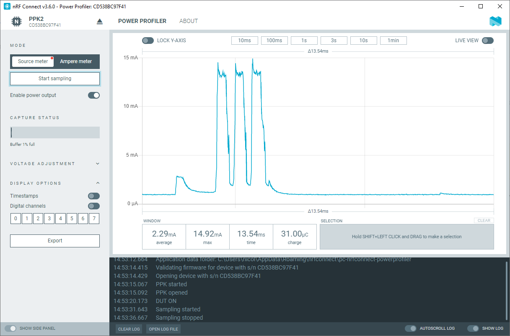

# Power Profiler app

The Power Profiler app is a tool to communicate with the
[Power Profiler Kit II (PPK2)](https://www.nordicsemi.com/Software-and-tools/Development-Tools/Power-Profiler-Kit-2),
an affordable and flexible tool to obtain real-time current measurements of your
designs.

The PPK measures current consumption for a connected Nordic Development Kit or
any external board. It gives a detailed picture of the current profile for the
user application.

The support for
[Power Profiler Kit (PPK1)](https://www.nordicsemi.com/Software-and-tools/Development-Tools/Power-Profiler-Kit)
has been deprecated since the
[Power Profiler app v4.0.0-beta1](https://github.com/NordicSemiconductor/pc-nrfconnect-ppk/blob/main/Changelog.md).
The last application version to support PPK1 is
[v3.5.5](https://github.com/NordicSemiconductor/pc-nrfconnect-ppk/blob/main/Changelog.md)
with
[nRF Connect for Desktop v4.4.0](https://github.com/NordicSemiconductor/pc-nrfconnect-launcher/blob/main/Changelog.md).

## Installation

The Power Profiler app is installed from nRF Connect from Desktop. For detailed
steps, see
[Installing nRF Connect for Desktop apps](https://docs.nordicsemi.com/bundle/nrf-connect-desktop/page/installing_apps.html)
in the nRF Connect from Desktop documentation.

## Documentation

Read the
[Power Profiler app](https://docs.nordicsemi.com/bundle/nrf-connect-ppk/page/index.html)
official documentation for information about its UI and features.

(The documentation is valid for PPK2. If you use the first version of the
hardware, see the
[online documentation for PPK1](https://docs.nordicsemi.com/bundle/ug_ppk/page/UG/ppk/PPK_user_guide_Intro.html)).

## Development

See the
[app development](https://nordicsemiconductor.github.io/pc-nrfconnect-docs/)
pages for details on how to develop apps for the nRF Connect for Desktop
framework.

## Feedback

Please report issues on the [DevZone](https://devzone.nordicsemi.com) portal.

## Contributing

See the
[infos on contributing](https://nordicsemiconductor.github.io/pc-nrfconnect-docs/contributing)
for details.

## License

See the [LICENSE](LICENSE) file for details.

## File format

The app stores data in and reads data from `*.ppk2` files. There are no
guarantees that the format will remain the same. But you can see in the source
code, that it currently is like this:

A ppk2 file is a zip compressed file, containing 3 files:

-   `session.raw`
-   `minimap.raw`
-   `metadata.json`

Mandatory Data:

-   `session.raw` in
    [class FileData](https://github.com/NordicSemiconductor/pc-nrfconnect-ppk/blob/6e4da637f07d5f6995d96362368c781b71b5bc61/src/globals.ts#L53-L112)

    -   4 bytes for current: decimal in μA
    -   2 bytes for the digital channels: 2 bits per channel, LSB is digital
        channel 1 (D8-D7-D6-D5-D4-D3-D2-D1). Conversion of the 8-bit digital
        input to the 16-bit format is done in
        [the function `convertBits16`](https://github.com/NordicSemiconductor/pc-nrfconnect-ppk/blob/6e4da637f07d5f6995d96362368c781b71b5bc61/src/utils/bitConversion.ts#L21)

-   Minimap condensed data in
    [FoldingBuffer#saveToFile](https://github.com/NordicSemiconductor/pc-nrfconnect-ppk/blob/6e4da637f07d5f6995d96362368c781b71b5bc61/src/utils/foldingBuffer.ts#L118-L128)
-   Metadata stored in
    [`saveFileHandler`](https://github.com/NordicSemiconductor/pc-nrfconnect-ppk/blob/6e4da637f07d5f6995d96362368c781b71b5bc61/src/utils/saveFileHandler.ts#L57-L60)
    (samples per second must be the same as supported by our app)

**Important**: No negative values are supported! Any values < 0.2 μA are
interpreted as 0.

Final compression of the 3 files into ppk2 in
[`saveFileHandler`](https://github.com/NordicSemiconductor/pc-nrfconnect-ppk/blob/6e4da637f07d5f6995d96362368c781b71b5bc61/src/utils/saveFileHandler.ts#L40).
