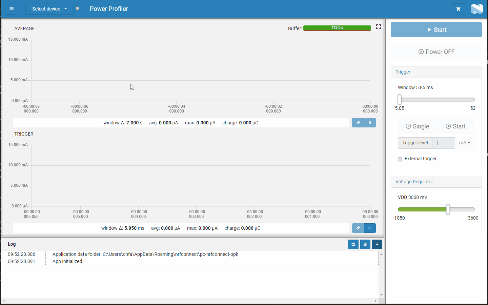

# nRF Connect Power Profiler

Power Profiler app for [nRF Connect](https://github.com/NordicSemiconductor/pc-nrfconnect-core).

## Introduction

*nRF Connect Power Profiler* is a tool to communicate with the The Power Profiler Kit (PPK), an affordable and flexible tool to obtain real-time current measurements of your designs.
The PPK measures current consumption for a connected nRF5x Development Kit or any external board. It measures current from 1 μA up to 70 mA and gives a detailed picture of the current profile for the user application.

All functionality is described in the [User Guide](https://infocenter.nordicsemi.com/topic/ug_ppk/UG/ppk/PPK_user_guide_Intro.html).

## Installation

See the [InfoCenter](https://infocenter.nordicsemi.com/index.jsp?topic=%2Fstruct_nrftools%2Fstruct%2Fnrftools_nrfconnect.html) pages for information on how to install the application.

## Development

See the [app development](https://github.com/NordicSemiconductor/pc-nrfconnect-core/wiki) pages for details on how to develop apps for the nRF Connect for Desktop framework.

## Feedback

Please report issues on the [DevZone](https://devzone.nordicsemi.com) portal.

## Contributing

See the [Contributing](https://github.com/NordicSemiconductor/pc-nrfconnect-core/wiki/Contributing) file for details.

## License

See the [LICENSE](LICENSE) file for details.
