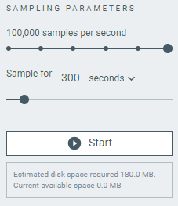

# Overview and user interface

The {{app_name}} has two views that provide detailed power consumption information.

## Select Device

Once you connect a device to the system, it becomes visible and available when you click on the **Select device** drop-down list. You can choose a device from the list of connected devices to perform further actions on the device such as programming.

You can access the following options by selecting the arrow under the device name.

- Show the device at the top of the list by making it favorite.
- Rename the device.
- View device COM ports.

## Device panel sections before device selection

Before you select a device, you can only load a power profiler file, open a link to an online purchase page, check documentation, or configure temporary disk data.

### Load

The **Load** button lets you open a `.ppk2` or a `.ppk` power profiler file.

!!! note "Note"
      Loading a `.ppk` file will automatically convert it to a `.ppk2` file.
      The new file will be saved next to the original `.ppk` file.

      Support for converting `.ppk` files will be removed in the future.

### Temp disk

These options only appear before selecting the device or when the device is selected and in the [**Data logger** sampling mode](#sampling-tabs).

Here you can set the root directory where the sampling file will be saved by default and define how much hard drive space you want to keep free when you start sampling.
The sampling will automatically stop when the hard drive has less than the defined amount.

## Device panel sections after device selection

More options become available after selecting a device. Some options are specific to the selected [sampling mode tab](#sampling-mode-tabs).

### Power supply mode

Here you can select one of the power supply modes for the PPK2, depending on your hardware setup:

| Mode                              | PPK LED color | Description                                                                                          |
|-----------------------------------|---------------|------------------------------------------------------------------------------------------------------|
| **Source meter**                  | Breathing red | In this mode, Device Under Test (DUT) is [supplied power by the PPK2](https://docs.nordicsemi.com/bundle/ug_ppk2/page/UG/ppk/measure_current_source_meter.html). You can **Set supply voltage** output to the DUT by using the slider or typing the required voltage. |
| **Ampere meter**                  | Breathing blue| In this mode, DUT is [supplied power from an external source](https://docs.nordicsemi.com/bundle/ug_ppk2/page/UG/ppk/measure_current_ampere_meter.html).       |

Both modes let you **Enable power output** on or off, which turns DUT on or off. The **Ampere meter** mode, when selected, turns this option on by default.

### Sampling parameters

Here you can select the sampling parameters. The parameters are different depending on the [sampling mode tab selected](#sampling-mode-tabs).

This is also where you can **Start** sampling.

After sampling starts, the **Start** button changes to **Stop**.
Before you can start sampling again, [**Save/Export**](#other-options) the session data or take a [**Screenshot**](#other-options)
If you don't, you will be prompted about saving any unsaved sampling data before you start sampling again.

!!! note "Note"

    {{session_recovery_info}}

#### Data logger parameters

When sampling in the **Data logger** mode, you can select the amount of samples per second that will be recorded.
The slider lets you select different values up to 100 000 samples per second (100 kHz).
You can also specify how long the sampling is supposed to last (**forever** by default).

After pressing **Start**, the sampling lasts to the moment the sampling time value is reached.
If you specified the sampling to last **forever**, the sampling will last until you manually **Stop** it or until the [**Disk full trigger**](#temp-disk) limit is reached.

Based on the chosen options, the Power Profiler application estimates the disk space usage.

#### Scope parameters

When sampling in the **Scope** mode, the sampling starts only when the specified [**Trigger settings**](#trigger-settings) are reached. The sampling then lasts for the specified **Length** value.
The sampling always happens at 100 000 samples per second (100 kHz).

The following table lists all available Scope parameters.

| Option                            | Description                                                                                          |
|-----------------------------------|------------------------------------------------------------------------------------------------------|
| **Length**                        | Total time *after* the trigger event during which the application samples and displays the data.     |
| **Offset**                        | Total time *before* the trigger event during which the application samples and displays the data. If sampling runs for a shorter period of time than the value of **Offset** when the trigger happens, only sampling for this shorter period of time is displayed.                 |
| **Single**                        | Select this option to stop sampling after one trigger event takes place.                             |
| **Continuous**                    | Select this option to continue sampling after one trigger event, and display trigger events until you click **Stop**. The first trigger must be fulfilled for the specified **Length** before another trigger can be displayed.       |

### Trigger settings

Trigger settings are only available when sampling in the **Scope** sampling mode.
You can set either analog or digital trigger conditions.

#### Analog trigger settings

For analog triggers, you can set the level value and when the trigger happens in relation to the level value.

The following table lists the available analog trigger settings.

| Option                            | Description                                                                                          |
|-----------------------------------|------------------------------------------------------------------------------------------------------|
| **Level**                         | The current value at which the trigger takes place. After you record some data, you can also set this value using an arrow in the **Data logger** chart.          |
| **Rising Edge**                   | Trigger happens when the signal transitions from a value lower than the value of **Level** to a higher value.        |
| **Falling Edge**                  | Trigger happens when the signal transitions from a value higher than the value of **Level** to a lower value.        |

#### Digital trigger settings

For digital triggers, you can configure the conditions for digital channels 0 through 7 and the logic that should be applied to the conditions.

The following table lists the available digital trigger settings.

|       Option       |                                 Description                                 |
| ------------------ | --------------------------------------------------------------------------- |
| **High**           | Set the trigger to happen when the channel goes from 0 to 1, low to high.   |
| **Low**            | Set the trigger to happen when the channel goes from 1 to 0, high to low.   |
| **Any**            | Set the trigger to happen when the channel goes either **High** or **Low**. |
| **Off**            | Channel state is not considered.                                            |
| **AND** and **OR** | Select the logic operator to combine multiple channel conditions.           |

### Display options

The following table lists the available display options.

| Option                            | Description                                                                                          |
|-----------------------------------|------------------------------------------------------------------------------------------------------|
| **Timestamps**                    | Show or hide the timestamps at the bottom of the sampling chart.                                     |
| **Relative** and **Absolute**     | Select how the time value of the **Timestamps** is to be displayed: relative to the start of the sampling or using machine time (UTC, adjusted per time zone of the machine settings).  If you [**Load**](#device-panel-sections) an old `.ppk` file, the timestamp value will not be shown because of the lack of metadata.         |
| **Digital channels**              | Show or hide the [digital channels](#digital-channels) under the sampling chart.                     |
| **Show Minimap**                  | Toggle to show or hide the navigable minimap under the **Data logger**'s chart. You can use the minimap to inspect the logged sampling results and navigate quickly in the time range of the recording. |

### Save options

The following options let you save the results of the sampling. They are only available for selection after you start logging sampling data.

| Option                            | Description                                                                                          |
|-----------------------------------|------------------------------------------------------------------------------------------------------|
| **Save/Export**                   | Available only after sampling is stopped. Saves the results of the data sampling to a `.ppk2` file, which you can [**Load**](#device-panel-sections) in a new session of the {{app_name}}. |
| **Screenshot**                    | Saves the current data from either the **Data logger** or the **Scope** view as a PNG image.                                          |

### Advanced configuration

The advanced configuration panel gives you access to filter tuning and lets you adjust gains for all individual ranges.

#### Gains

If any of the ranges (see [Measurement resolution](https://docs.nordicsemi.com/bundle/ug_ppk2/page/UG/ppk/ppk_measure_resolution.html#ppk_measure_resolution__table_b3l_3ty_bdb)) has an offset, use these configuration options to add a positive or negative gain to the calculated measurement values.

#### Spike filter

Whenever a dynamic range switching occurs, induced inductance may cause the first samples to be higher than the actual value.

Use the sliders to set the following:

- Samples to smooth - The number of samples after a dynamic range switch to apply the filer.
- Coefficient for range 1–4 - The magnitude of the spike filter for range 1–4. The higher the value, the more filtering will be applied.
- Coefficient for range 5 - The magnitude of the spike filter for range 5. The higher the value, the more filtering will be applied.

#### Voltage limit

Use this control to set the voltage limit for the measurement.

## Sampling mode tabs

The {{app_name}} comes with two sampling modes: **Data logger** and **Scope**.

- The **Data logger** sampling mode lets you examine the power continuously over a period of time.
  It has its own [sampling parameters](#data-logger-parameters) and lets you use the **Live Now** toggle to jump back to displaying the live measurement.

    

- The **Scope** sampling mode lets you sample only when the values specified for the **Length** and **Level** [sampling parameters](#real-time-parameters) have been reached.
  You can use the blue slider on the Y-axis to dynamically select the value of the **Level** parameter.

    

Both modes have their own [sampling parameters](#sampling-parameters), but share most of the sampling chart UI, explained in the following sections.

## Sampling chart

This is the area where you can track and inspect the measurements being recorded.

The following actions are common to both sampling modes:

- Hover over the chart to display detailed measurement values.
- Click and hold the left mouse button over the chart and drag the mouse to scroll the chart right and left.
- Toggle **Lock Y-axis** to prevent the Y-axis changing its values dynamically when you scroll the chart. You can also manually set the values for locking Y-axis in [chart settings](#chart-settings).
- Use the time frame value buttons to scale the X-axis size.
- Make [selection](#window-and-selection) of a specific fragment of the measurement.

### Chart settings

You can access the chart settings by clicking the gear icon in the top left corner, next to the **Lock Y-axis** toggle.
Here you can set the values for locking the Y-axis and enable the logarithmic Y-axis.

### Minimap

This is the summary of the whole measurement for scrolling and search, both in Y-axis and [logarithmic Y-axis](#chart-settings).
It is only available in the **Data logger** sampling mode.

### Window and selection

The bottom sections of the sampling chart display the average and maximum measurement values for the selected time interval:

- **Window** displays values for the measurement from start to finish. Selecting a different time frame value changes the values shown.

    

- **Selection** displays values for a part of the measurements.

    

    You can make a selection in the measurement chart by pressing **Shift** and dragging the left mouse button. The selected part is highlighted in grey and included between two grey sliders.

    

### Digital channels

The digital signals are visible in the charting section below the current measurement.

The digital signals are connected to the PPK2's Logic port as described in [Logic port](https://docs.nordicsemi.com/bundle/ug_ppk2/page/UG/ppk/logic_port.html). To view the digital values, enable digital channels and zoom in on the main chart until the values are visible.

To select which digital channels you see, use the **Digital channels** menu in [**Display options**](#display-options).

## Feedback tab

The Feedback tab lets you send feedback about the {{app_name}} to the application development team.

## About tab

Here you can view application information, restore settings to default, access source code, and documentation. You also can find information on the selected device, access support tools, and enable verbose logging.

## Log

The Log panel allows you to view the most important log events, tagged with a timestamp. Each time you open the app, a new session log file is created. You can find the Log panel and its controls, below the main application Window.

- When troubleshooting, to view more detailed information than shown in the Log panel, use **Open log file** to open the current log file in a text editor.
- To clear the information currently displayed in the Log panel, use **Clear Log**. The contents of the log file are not affected.
- To hide or display the Log panel in the user interface, use **Show Log**.
- To freeze Log panel scrolling, use **Autoscroll Log**.