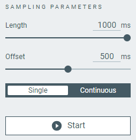

# Overview and user interface

The nRF Connect Power Profiler app has two views that provide detailed power consumption information.

## Select Device

Once you connect a device to the system, it becomes visible and available when you click on the **Select device** drop-down list. You can choose a device from the list of connected devices to perform further actions on the device such as programming.

You can access the following options by selecting the arrow under the device name.

- Show the device at the top of the list by making it favorite.
- Rename the device.
- View and select between device COM ports.

## Device panel sections

Before you select a device, this section lets you only **Load** a `.ppk2` power profiler file.

More options become available after selecting a device.

### Mode

Here you can select one of the power supply modes for the PPK2, depending on your hardware setup:

| Mode                              | PPK LED color | Description                                                                                          |
|-----------------------------------|---------------|------------------------------------------------------------------------------------------------------|
| **Source meter**                  | Breathing red | In this mode, Device Under Test (DUT) is [supplied power by the PPK2](https://docs.nordicsemi.com/bundle/ug_ppk2/page/UG/ppk/measure_current_source_meter.html). You can **Set supply voltage** output to the DUT by using the slider or typing the required voltage. |
| **Ampere meter**                  | Breathing blue| In this mode, DUT is [supplied power from an external source](https://docs.nordicsemi.com/bundle/ug_ppk2/page/UG/ppk/measure_current_ampere_meter.html).       |

Both modes let you **Enable power output** on or off, which turns DUT on or off. The **Ampere meter** mode, when selected, turns this option on by default.

### Sampling parameters

Here you can select the sampling parameters for the power profiling. The parameters are different depending on the sampling mode.

This is also where you can **Start** sampling and select the amount of samples per second that will be recorded.
The slider lets you select values from 1 sample per second to 100 000 samples per second. This corresponds to sampling at 1 Hz to 100 kHz, respectively.

After sampling starts, the **Start** button changes to **Stop**.
Before you can start sampling again, you need to **Clear session data** from the **Data logger**'s chart.

!!! info "Tip"
      Before you **Clear session data**, make sure to [**Save/Export**](#other-options) the session data or take a [**Screenshot**](#other-options).

#### Data logger parameters

When sampling in the **Data logger** mode, the sampling lasts by default from the moment in which you click **Start** to the moment the **Auto stop sampling** sample time value is reached.
If you disable **Auto stop sampling**, the sampling will last until you **Stop** it.

Based on the chosen options, the Power Profiler application estimates the disk space usage.

#### Real time parameters

When sampling in the **Real time** mode, the sampling starts only when the specified **Length** and **Level** values are reached.

The following table lists all available Real time parameters.

| Option                            | Description                                                                                          |
|-----------------------------------|------------------------------------------------------------------------------------------------------|
| **Length**                        | Total time before and after the **Level** current value is reached. The application will try to record the trigger at the middle of the provided value.  |
| **Level**                         | The current value at which the trigger takes place. The trigger always happens at the rising edge. After you record some data, you can also set this value using an arrow in the **Data logger** chart.          |
| **Auto export**                   | Enable this option to automatically export the session data that are going to be recorded to a `.ppk2` file. You can select the export directory when you enable this option and start sampling.       |
| **Single**                        | Select this option to stop sampling after one trigger event takes place.       |
| **Continuous**                    | Select this option to continue sampling after one trigger event, and display trigger events until you click **Stop**.       |

### Display options

The following table lists the available display options.

| Option                            | Description                                                                                          |
|-----------------------------------|------------------------------------------------------------------------------------------------------|
| **Timestamps**                    | Show or hide the timestamps at the bottom of the sampling chart.                                     |
| **Relative** and **Absolute**     | Select how the time value of the **Timestamps** is to be displayed: relative to the start of the sampling or using machine time (UTC, adjusted per time zone of the machine settings).  If you [**Load**](#device-panel-sections) an old `.ppk` file, the timestamp value will be greyed out because of the lack of metadata.         |
| **Digital channels**              | Show or hide the [digital channels](#digital-channels) under the sampling chart.                     |

### Other options

The following options are only available when you log sampling data.

| Option                            | Description                                                                                          |
|-----------------------------------|------------------------------------------------------------------------------------------------------|
| **Show Minimap**                  | Toggle to show or hide the navigable minimap under the **Data logger**'s chart. You can use the minimap to inspect the logged sampling results. |
| **Save/Export**                   | Available only after sampling is stopped. Saves the results of the data sampling to a `.ppk2` file, which you can [**Load**](#device-panel-sections) in a new session of nRF Connect Power Profiler. |
| **Screenshot**                    | Saves the current data from either the **Data logger** or the **Real time** view as a PNG image.                                          |

## Sampling tabs

nRF Connect Power Profiler comes with two sampling modes: **Data logger** and **Real time**.

The **Data logger** mode lets you examine the power continuously over a period of time.

The **Real time** mode lets you sample only when the values specified for the **Length** and **Level** [sampling parameters](#real-time-parameters) have been reached.

Both modes have their own [sampling parameters](#sampling-parameters), but share most of the sampling UI, explained in the following sections.

### Sampling chart

#### Chart settings

#### Minimap

#### Window and selection

### Digital channels

The digital signals are visible in the charting section below the current measurement.

The digital signals are connected to the PPK2's Logic port as described in [Logic port](https://docs.nordicsemi.com/bundle/ug_ppk2/page/UG/ppk/logic_port.html). To view the digital values, enable digital channels and zoom in on the main chart until the values are visible.

### Advanced controls

The advanced control panel gives you access to filter tuning and lets you adjust gains for all individual ranges.

Press **CTRL-ALT-SHIFT-A** to access the advanced control panel.

#### Gains

If any of the ranges (see [Measurement resolution](https://docs.nordicsemi.com/bundle/ug_ppk2/page/UG/ppk/ppk_measure_resolution.html#ppk_measure_resolution__table_b3l_3ty_bdb)) has an offset, use these controls to add a positive or negative gain to the calculated measurement values.

#### Spike filter

Whenever a dynamic range switching occurs, induced inductance may cause the first samples to be higher than the actual value.

Use the sliders to set the following:

- Samples to smooth - The number of samples after a dynamic range switch to apply the filer.
- Coefficient for range 1–4 - The magnitude of the spike filter for range 1–4. The higher the value, the more filtering will be applied.
- Coefficient for range 5 - The magnitude of the spike filter for range 5. The higher the value, the more filtering will be applied.

## Feedback tab

The Feedback tab lets you send feedback about nRF Connect Power Profiler application to the application development team.

## About tab

Here you can view application information, restore settings to default, access source code, and documentation. You also can find information on the selected device, access support tools, and enable verbose logging.

## Log

The Log panel allows you to view the most important log events, tagged with a timestamp. Each time you open the app, a new session log file is created. You can find the Log panel and its controls, below the main application Window.

- When troubleshooting, to view more detailed information than shown in the Log panel, use **Open log file** to open the current log file in a text editor.
- To clear the information currently displayed in the Log panel, use **Clear Log**. The contents of the log file are not affected.
- To hide or display the Log panel in the user interface, use **Show Log**.
- To freeze Log panel scrolling, use **Autoscroll Log**.