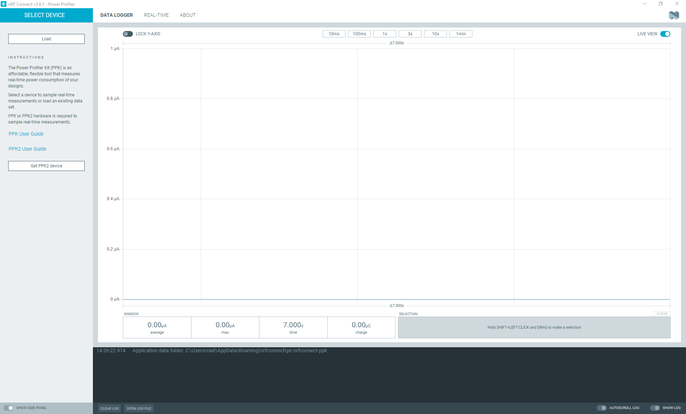
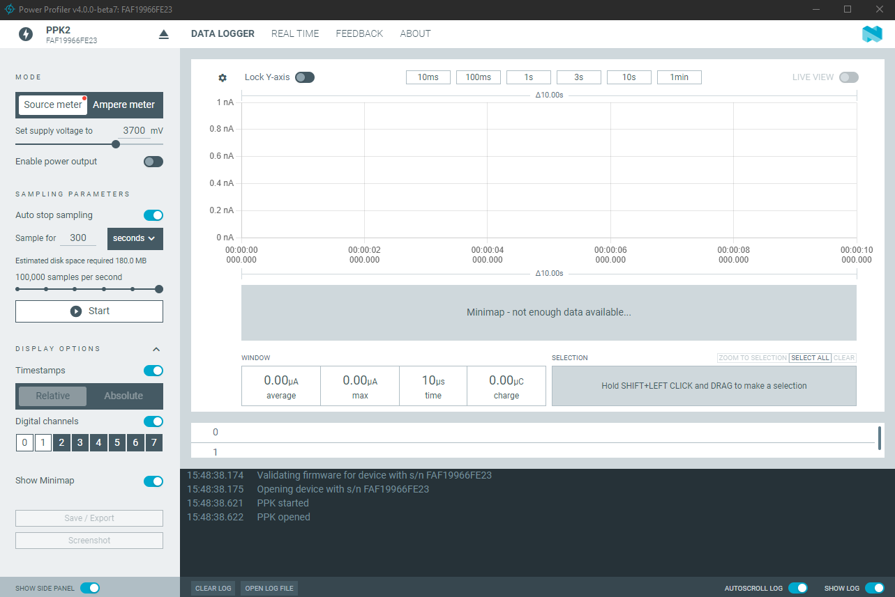

# Using the Power Profiler app

The Power Profiler Kit II (PPK2) must be connected to your computer and powered on before the Power Profiler app is started.

1. [Set up the Power Profiler Kit II for measurements](https://docs.nordicsemi.com/bundle/ug_ppk2/page/UG/ppk/setting_up.html).
1. Open the Power Profiler app using [nRF Connect](https://docs.nordicsemi.com/bundle/nrf-connect-desktop/page/installing_apps.html).

    

1. Click **Select Device** (in the top left corner) and select the PPK2 from the list. 
   The Power Profiler app checks if the PPK2 has the required firmware and shows a firmware upgrade dialog if needed. The application UI is updated.

    

1. In the device panel's **Mode**, select [**Source meter**](./overview.md#power-supply-mode) or [**Ampere meter**](./overview.md#power-supply-mode).
1. Select the [**Data logger**](./overview.md#sampling-mode-tabs) or [**Scope**](./overview.md#sampling-mode-tabs) sampling mode.
1. Set the desired [**Sampling parameters**](./overview.md#sampling-parameters).
1. Click **Start** to start sampling.
1. Toggle **Enable power output** to enable power to the DUT.
1. Click **Stop** to stop sampling.

At the end of the sampling, you can click [**Save/Export**](./overview.md#save-options) to save the sampling data to a `.ppk2` or `.csv` file.

!!! note "Note"

    {{session_recovery_info}}
